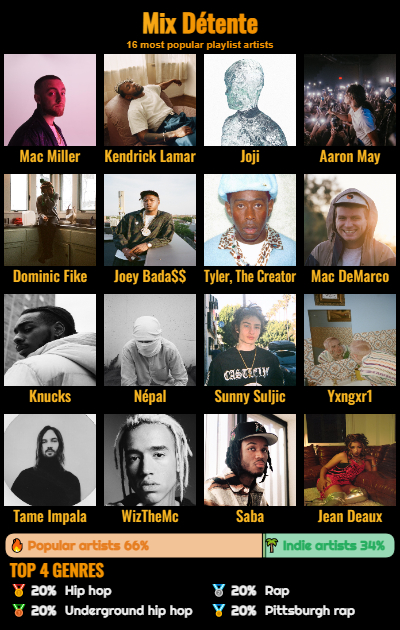

    

# HUSKYFY - Interact with Spotify playlists smoothly

![Huskyfy Version](https://img.shields.io/badge/dynamic/json.svg?url=https://raw.githubusercontent.com/s-rigaud/huskyfy/main/package.json&label=Huskyfy&query=$.version&color=red&logo=data:image/png;base64,iVBORw0KGgoAAAANSUhEUgAAACAAAAAgCAMAAABEpIrGAAAACXBIWXMAAABgAAAAYADwa0LPAAAC31BMVEVHcEz0kgDzkgDykQDzkwDqlQDzkgDzkwD0kgD1lQDzkgD/kgD/nwD0kgDzkgDzkgDzkgD0kgDzkgD0kwD0kwD0kAD0kgD0kgD0kwD0kgDtkgDwjwD0kwD0kgD0kgD0kQD0kwDsiQD/jgD0kgDylADzkgD0kgD0kgDzkgD0kwDzkgDzkgD2jgD0kQDzkgD0kQD0kQD0kgDzkwD1jwDzkgD1kgDzkgDzkgDy8vJCQkLx8fEAAADykQAjIyKlpaXu7u4tLSwREREnJyc6Ojo8PDxGRkYrIA/X19e0tLTU1NQfHx+jo6O2bQC5ublOTk6enp5NTU2ysrLxkQAQEA8kJCNERETc3NzDw8Pw8PAyMjKEUQUqKinujwCbXQDe3t7pjAAmJiV6enp9fX1AQECsaAOdXgAUEg7YggAHBwdpaWkWEw7p6enAwMAfGxRHR0c1NTXW1tbLy8urqqri4uLY2NiIiIjv7+8XDQ4bERIvFBhhQBCtaABVPBgoKCdWOhGBVBFoQgluRgvAcwCPVgHk5OSKUgEdGRLq6urQ0NClYwC4uLiQkJCgYACtra0pIxrr6+u7cABISEifn59wSxMPDg1xcXHVgADm5uYaGhm2traTk5O3bgIzMzNKSkrNewAhISGkpKQaGBU/Pz8MCwjj4+Pt7e0eHBh/TgVXPRaxsbF0TRHmigAdHR0hIB4PDAhMTEwSEA0VFBRFRUXf398RDgqmpqY0NDSOjo7iiADZ2dnSfgBvSQ5cXFxrRQxZOw1yTBPhhwAuIQ0VExDdhQCpqalnZ2d5TAcYFRAuIhDwkAAiIB7ghwCXl5eSWAB/UQ0tKykjHhfCwsJaWlpfQBEnJiWrZgDehQBzc3M1JhBUOhJrRg+FhYVvb288OzorKSeIVw4xLisrJRsyMCxfX1/GxsZjY2Lb29tiYmLT09MuJCWVEx/NOkvMOEomGBoVDg85NjY6NTaQEBskHB1QEBVNERVDZkrKAAAAN3RSTlMAx/olygzp+fQY6gcImuP14sb464cum5bIgQ4imZhZWFcNCYomjJ2c+y0V5RvBzFaX81UZ0DHTkjvnXQAAAnZJREFUGBllwQVbkwEUBtALDLbRiIUBKiF2+95vGyUNBiIIgt3YYICB3d3d3d3d3d3dXT/A3Q+Y8Owc+q+Md0mNo62to8bFpyJZ8wtwg4VbZTsqqpJ/IIqw9XWmQuwawopNPbJo4AigmwkWiYcBuJagfHaOAI6dvngG+a5EdT0CwFVPKuf6AE5eONf3VGuoLj1sldHjIICalUj4w6xL+54pSeehSrt7q2ejLjDzIjO/QJgdj2Tu2LVNm7QN1+716MAceQdmdfREFAARlcF8tvu23KBG7S93D2Z+EAVRiqiMG8T2Axx9NEJRRdyO5qt7IXQVyRui9ZrgyAjFbMpixSy8076d7SAqUEmI+auablWU5JRei5pMzkxWlKAd65dDlCMNxMy5LVYrixawam3z3Z3CWjSGsCFPiEnGVso8tuigLDVOhXAgLcSYsFnNZsxesb8t857wuGbrVvYJGwdRjLQQI4M2MS879CQ4ul9wx7YJzNOSRkEUI0+I4aFjmVPZ8MFofGPgVOYJocMgHEgDMSJ9IouBRuNAFi1zh0DYkAvE6KB4FoN+/AxhER83FKI8+UA1PcHA3Of3979/cj71ZTY0HZ8IUZfsdRBLdmUxZ2Z//vL1V/ZH5k0LG0Po7IkqQ3Ui/b2Bs3IGD/4Ww4aWoXOgciEiO1sI06NnsSFsiI1lDukXvtEEoS1LZr5QmR4/j+kfwjyof8yNzSaoipNwtkGezr3f9Row4O3Tm52Rx8OJVHp35Gn34tXrl72vb0GeatUpXwlXFLjfDQXcq5BF1Rqw4qGnQpy8dChCW9yJitKX0sFCV64sWbOvUL60g1brULp2LXuy+AdClvgN41/UHwAAAABJRU5ErkJggg==)

## Stack

## Functionalities ⚡

[Huskyfy website](https://www.huskyfy.com) offers different functionalities to tune and play with your Spotify playlists, you can :

* browse your playlists 🗃

* duplicate any playlist, once yours you can tweak them to make sure they absolutely fits you 📑

* filter tracks according to artist popularity, name or genres ✂️

* get some insights about which playlist contains the more indie artists 📊

* see which genres are more present in each playlist 📈

* sort playlist tracks according to most popular genres or artists in the playlist 📚

* save image recaps about all the informations of your playlists 🖼️

    

## Bugs 🐛

If you find any bug, do not hesitate to report it as a Github Issue or to send a mail at huskyfy.bugtracker@gmail.com 📧
